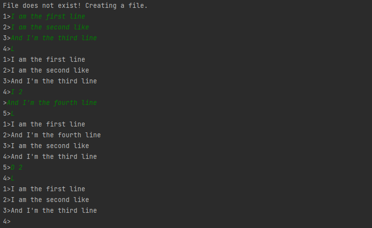

# line-editor

This is a small program that utilizes a linked-list to store lines of text in memory until the user exits the program and writes the contents to a file. The user can open a text file with content in it and use commands L, D and I to list, delete or insert a line.

